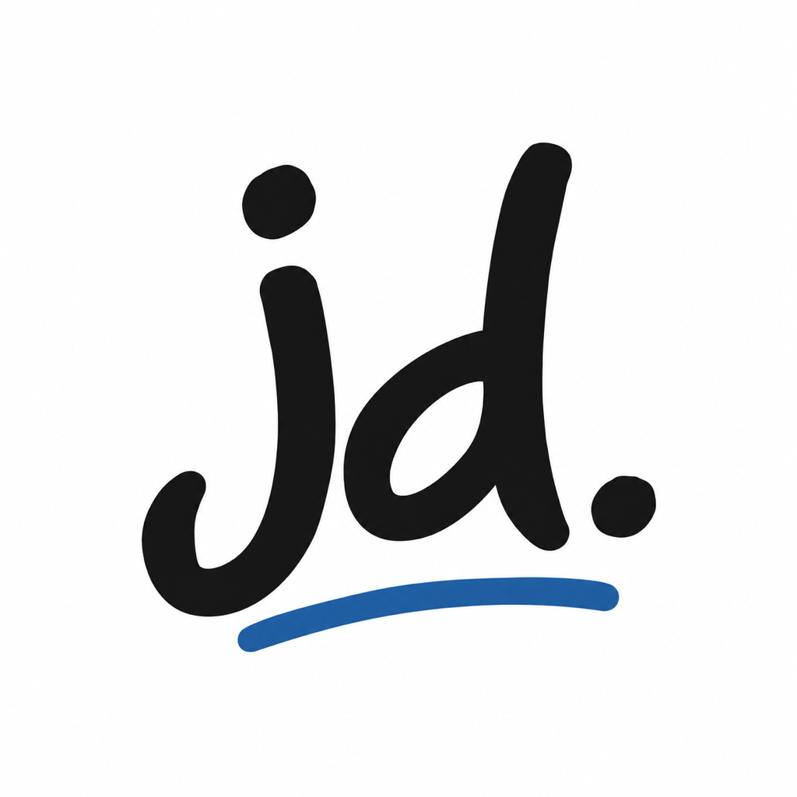
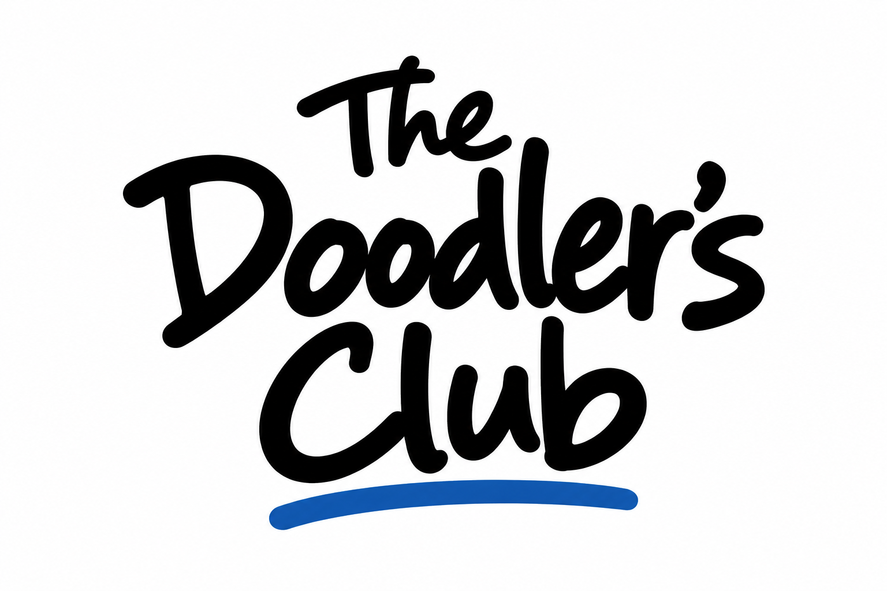

# Just Doodle / Signature Kit

September 27, 2026. Black felt-tip lettering, open counters, white space, and one blue ink underline. The compact `jd.` monogram connects the app icon to The Doodler's Club without cramming the full name into a tiny square.

<table>
  <tr><th>App icon</th><th>The Doodler's Club</th></tr>
  <tr>
    <td></td>
    <td></td>
  </tr>
</table>

## Files

| Asset | File | Where it belongs |
| :--- | :--- | :--- |
| App icon | [1024 x 1024 PNG](../JustDoodle/Assets.xcassets/AppIcon.appiconset/JustDoodleAppIcon.png) | Xcode AppIcon catalog. Opaque, square, with no baked-in corner mask. |
| Compact monogram | [Transparent PNG](../JustDoodle/Assets.xcassets/DoodlersClubMark.imageset/doodlers-club-mark.png) | Home header, splash, and empty Doodle Book. |
| Just Doodle signature | [Transparent PNG](../JustDoodle/Assets.xcassets/JustDoodleWordmark.imageset/just-doodle-wordmark.png) | Home masthead. The app draws and animates its underline separately. |
| Club logo | [White-background PNG](doodlers-club-logo.png) | Community graphics, launch materials, and social posts. Not the small app icon. |

The in-app club title remains native text for legibility and accessibility. The home signature image has a VoiceOver label and heading trait. UI controls continue to use the system's Noteworthy face rather than rasterized labels.

## Use the Kit

- Keep the original aspect ratio and clear margins. Do not stretch or crop the lettering.
- Use transparent black-ink assets on light backgrounds. A separate reversed treatment would be needed for dark artwork.
- Use the compact monogram at small sizes; reserve the full club logo for larger placements.
- Keep the blue accent restrained. Do not add glows, shadows, gradients, or extra doodles around the marks.
- Let iOS apply the app-icon corner mask. The source stays fully square and opaque.

Generated with the built-in image-generation tool; see [the prompt record](PROMPTS.md). The app icon was resized to the catalog's required 1024 x 1024 dimensions. These are raster assets, not editable vector masters or a trademark clearance. Review the identity before publishing; previous branding remains in Git history.

[Project](../README.md) &middot; [Apple launch guide](../AppStore/GETTING_STARTED.md)
